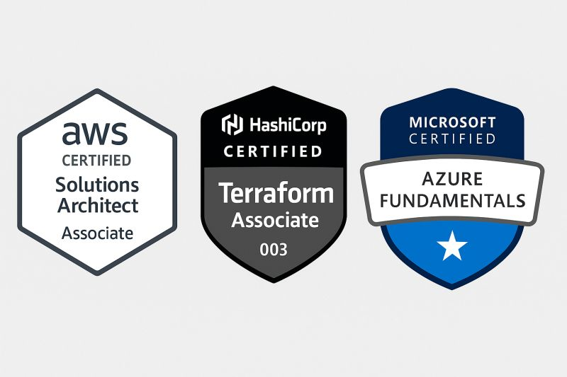

<h1 align="center">Hi there 👋, I'm Mushfeque</h1>

  

  <b>DevOps Infrastructure Engineer at Bank of America | MS in Software Engineering (DevOps) | Cloud & Automation Specialist</b>

---

### 🎓 Education & Certifications 

*   **M.S. in Software Engineering (DevOps)** - Western Governors University (2026)
*   **B.S. in Computer Systems** - CUNY New York City College of Technology

---

### 🚀 About Me

*   🔭 **Current Focus:** Managing enterprise-scale Kubernetes (OpenShift) and IaC (Terraform).
*   💬 **Ask me about:** CI/CD optimization, DevSecOps, and scaling cloud infrastructure.
*   📫 **How to reach me:** [mushfeque.zihan@gmail.com](mailto:mushfeque.zihan@gmail.com)
*   ⚡ **Fun Fact:** I automate everything—from production deployments to my personal budget.

  

---

### 🛠 Languages and Tools

  

---

### 📊 GitHub Statistics

  
  

  

